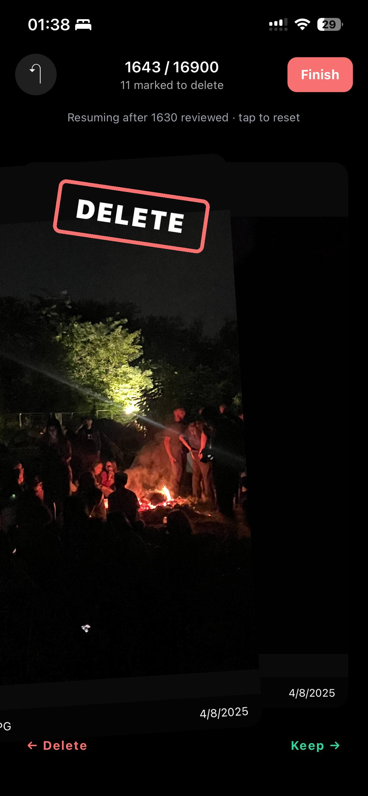
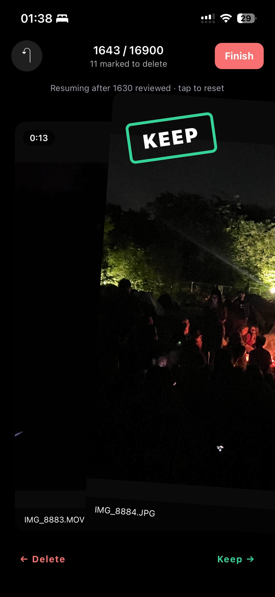

# PhotosCleaner

A personal iPhone app for cleaning up an overgrown camera roll using a Tinder-style swipe deck. **Swipe left to mark for deletion, swipe right to keep.** Decisions persist across sessions so you can chip away at a huge library a few items at a time, and at any point you can finish a session to delete everything you marked in a single iOS-confirmed batch.

Built with React Native + Expo SDK 54. Develops on Windows; runs on iOS. Currently designed to run inside **Expo Go** for personal use — no Apple Developer Program enrollment required.

## Screenshots

<p align="center">
  
  
</p>

<p align="center"><i>Left: a left-swipe in progress (DELETE badge). Right: a right-swipe revealing the next card underneath, which is a 13-second video.</i></p>

## Quick start

Runs inside the free **Expo Go** app on your iPhone — no signing, no Apple Developer account, no Mac.

**Prerequisites**
- Node.js 20+ on your machine (`node -v` to check)
- An iPhone on the same Wi-Fi as your machine
- The free **Expo Go** app from the App Store

**Steps**

```powershell
# 1. Install dependencies (first time only)
npm install

# 2. Start the dev server
npx expo start
```

On the iPhone:
1. Open **Expo Go**.
2. Scan the QR code shown in your terminal (use the iPhone camera, or Expo Go's built-in scanner).
3. The app loads. Grant **Full Photo Library** access on first run (Settings → Expo Go → Photos → All Photos if the prompt is missed).

Code changes hot-reload over Wi-Fi — edit any file under `src/`, save, the app refreshes.

**Useful flags**

| Command | When to use |
|---|---|
| `npx expo start` | Default — phone connects over local Wi-Fi |
| `npx expo start --clear` | After installing a native package or hitting weird module-resolution errors |
| `npx expo start --tunnel` | When phone and PC aren't on the same network (slower) |

> If you see `[runtime not ready]` or `Cannot find module …` after dependency changes, restart with `--clear`. Metro caches aggressively.

## Features

### Swipe deck
- Stacked-card UI with the next two cards peeking underneath.
- Left swipe = mark for deletion · right swipe = keep.
- Reanimated-4 driven: rotation, drift, snap-back, smooth swipe-off.
- **KEEP** / **DELETE** badges fade in as you drag past the commit threshold.
- **Undo** the last swipe in the current session.

### Photos and videos
- Loads everything from the camera roll, newest first.
- Photos render via `expo-image` with memory caching.
- Videos:
  - Thumbnail extracted from the first frame.
  - Tap the card to play inline.
  - Tap to pause / resume during playback.
  - Replay icon appears when the video reaches the end; tap to restart.
  - Automatically falls back to copying the file into Expo Go's sandbox if iOS denies direct access (some camera-roll paths require this).
  - iCloud-only videos download on demand; loading message changes to "Still loading…" if it's taking a while.

### Pinch-to-zoom (Instagram style)
- Two-finger pinch zooms toward the focal point — the spot under your fingers stays under your fingers.
- Drag with two fingers to pan around the zoomed view.
- Release to smoothly return to 1×.
- Works on both photos and videos, even during playback.

### Persistence
- Every decision is saved to AsyncStorage as you make it.
- On next launch, already-reviewed items are automatically skipped.
- A small "Resuming after N reviewed · tap to reset" banner appears at the top of the deck when past decisions are present.
- Reset wipes the app's memory of decisions; your photos are untouched.

### Batch delete
- iOS forces a confirmation dialog for any photo deletion — the app collects all left-swipes and triggers **one** native dialog at the end of a session via the **Finish** button.
- Confirm sheet shows count and thumbnails of everything marked for deletion before triggering the iOS dialog.
- Pending-delete list also persists across sessions, so you can swipe today and confirm the batch tomorrow.

## Tech stack

- **Expo SDK 54** managed workflow
- **TypeScript** end-to-end
- **expo-media-library** — camera-roll access, `deleteAssetsAsync` for batch delete
- **expo-image**, **expo-video**, **expo-video-thumbnails** — media rendering
- **expo-file-system** — sandbox copy fallback for restricted video paths
- **react-native-reanimated 4** + **react-native-gesture-handler** — gesture and animation primitives
- **@react-native-async-storage/async-storage** — decision persistence

## Project layout

```
App.tsx                          Root: permission gate + GestureHandlerRootView
index.ts                         Entry point
app.json                         Expo config (iOS bundle ID, permission strings, plugins)
eas.json                         EAS Build profiles
babel.config.js                  Reanimated worklets plugin
src/
  screens/
    PermissionScreen.tsx         Permission request / Open Settings fallback
    DeckScreen.tsx               Composes header, deck, confirm sheet, reset banner
  components/
    MediaCard.tsx                One photo or video card (thumb, player, retry UI)
    SwipeDeck.tsx                Gesture-driven card stack — pan, pinch+focal zoom
    HeaderBar.tsx                Counter + undo + finish
    ConfirmDeleteSheet.tsx       Modal with thumbnails + batch delete trigger
  hooks/
    useAssets.ts                 Paginated MediaLibrary fetch (page size 50)
    useDecisions.ts              Reducer for swipe history + undo + persistence
  lib/
    media.ts                     MediaLibrary, VideoThumbnails, sandbox-copy helpers
    storage.ts                   AsyncStorage helpers for decisions
```

## Expo Go caveats

- The app shows up as "Expo Go" on the home screen, not as a standalone PhotosCleaner icon.
- Your PC must be running `npx expo start` and be on the same Wi-Fi as the phone (or use `--tunnel` for cross-network).
- Permissions are inherited from Expo Go's own Info.plist.
- Some camera-roll videos hit iOS sandbox restrictions; the app auto-recovers by copying into Expo Go's writable cache, but the workaround adds ~0.1–1 s of delay.

For a standalone home-screen install without Expo Go, see [Standalone build](#standalone-build-optional).

## Standalone build (optional)

If you want PhotosCleaner as its own app on the home screen, with its own icon and proper permission strings:

### Free Apple ID — limited
EAS Build's automatic credential provisioning requires a paid developer account. With only a free Apple ID, the workaround is to build the unsigned `.ipa` on a free macOS runner (e.g. GitHub Actions) and then sign it locally with Sideloadly using your free Apple ID. Re-signing is required every 7 days.

### Paid ($99/yr) — smoothest
```powershell
npm install -g eas-cli
eas login              # log in with your Expo account (create at expo.dev/signup)
eas init               # links this folder to a new Expo project
eas build --profile preview --platform ios
```

EAS will handle Apple credentials automatically. Output is an `.ipa` you can install via TestFlight or Sideloadly. The app stays installed for a full year per re-sign.

## Known constraints

- **iOS mandates the delete confirmation dialog.** No way to suppress it. The "batch at end" choice minimizes how often you see it (once per session instead of once per photo).
- **Live Photos / Bursts** count as single assets in MediaLibrary; deletion removes the entire stack.
- **iCloud-only items** require a download before they can be displayed or played; large videos can take a while on slow connections. Swipe to skip if you don't want to wait.
- **Expo Go video sandbox quirks**: some videos require a copy-to-sandbox fallback inside Expo Go. A standalone development build doesn't hit this.
